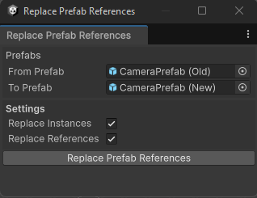

# Bulk Editor
The Bulk Editor package provides access to a number of production-tested utilities for performing bulk asset editing across a Unity project via code. This can be very useful for updating, verifying, and maintaining large numbers of assets in larger projects.

## Installation
Bulk Editor relies on my [Unity Internal Access](https://github.com/jonagill/UnityInternalAccess) library for certain functionality. We recommend you install both libraries via [OpenUPM](https://openupm.com/packages/com.jonagill.bulkeditor/). Per OpenUPM's documentation:

1. Open `Edit/Project Settings/Package Manager`
2. Add a new Scoped Registry (or edit the existing OpenUPM entry) to read:
    * Name: `package.openupm.com`
    * URL: `https://package.openupm.com`
    * Scope(s): `com.jonagill.bulkeditor` and `com.jonagill.unityinternalaccess`
3. Click Save (or Apply)
4. Open Window/Package Manager
5. Click the + button
6. Select `Add package by name...` or `Add package from git URL...` 
7. Enter `com.jonagill.unityinternalaccess` and click Add
8. Repeat steps 6 and 7 with `com.jonagill.bulkeditor`

# Usage

## BulkEditing.cs
Most of the functionality of the package is available through the `BulkEditing` static class. This class contains many useful functions, but the big three are `RunFunctionAcrossAllInstancesOfComponent()`, `RunFunctionInAllScenes()`, and `RunFunctionOnAllPrefabs()`. These can be used to run the same function across many assets in the project. You can do this to perform validation (e.g. logging the state of some serialized value across the project) or to perform bulk editing by modifying the assets as you load them. Note that the callbacks passed to these methods must return `true` if you have changed any data in order to dirty and save the relevant asset.

### Examples

```
    [MenuItem( "Migrate/Migrate Component Data" )]
    private static void MigrateComponents()
    {
        BulkEditing.RunFunctionAcrossAllInstancesOfComponent<MyComponent>( "Migrate", instance =>
        {
            if ( instance.oldData )
            {
                // Perform your migration
                instance.newData = instance.oldData;
                instance.oldData = null; 

                // Return true to notify the runner that this asset needs to be saved
                return true;
            }

            // Return false to indicate that we did not change this asset
            return false;
        } );
    }

    [MenuItem( "Migrate/Migrate Prefab Data" )]
    private static void MigratePrefabs()
    {
        BulkEditing.RunFunctionOnAllPrefabs( "Migrating Prefabs", (path, go) =>
        {
            // Only bother loading the prefab into editing if it has the component we're interested in
            if ( go.GetComponentInChildren<TestClass>() != null )
            {
                // Load a mutable copy of the prefab for editing
                using ( var editingScope = new EditPrefabContentsScope( path ) )
                {
                    // Get the component we're interested in modifying
                    var componentToModify = editingScope.prefabContentsRoot.GetComponentInChildren<TestClass>( true );
                    if ( componentToModify != null )
                    {
                        // Check that the value we're going to modify isn't already set
                        // This may seem redundant but if we don't check this, Unity will save same
                        // value into every variant as an override.
                        if ( componentToModify.testValue != 7 )
                        {
                            // Modify our value
                            componentToModify.testValue = 7;

                            // Mark our scope dirty so that it saves the asset on dispose
                            editingScope.MarkDirty();
                            return true;
                        }
                    }
                }
            }

            return false;
        } );
    }


```

## Scopes
Two useful `IDisposable` scopes are included in the package:

### AssetEditingScope
This scope wraps calls to `AssetDatabase.StartAssetEditing()` and `AssetDatabase.StopAssetEditing()`. This is easier to use than the discrete calls and guarantees that you have a matching number of calls to each function, preventing the Asset Database from getting locked accidentally.

```
using (new AssetEditingScope()) 
{
    // Change your assets in here
}

AssetDatabase.SaveAssets();
```

### EditPrefabContentsScope

An alternate version of Unity's default [PrefabUtility.EditPrefabContentsScope](https://docs.unity3d.com/2020.1/Documentation/ScriptReference/PrefabUtility.EditPrefabContentsScope.html). However, Unity's version always attempts to save the prefab when it gets unloaded, which can be very slow. This version will only trigger a save if you call `scope.MarkDirty()` on it during editing.

## Menu Items
This package adds a number of useful menu items under the `Tools/Bulk Editing` menu path. These mostly provide convenient ways to remove missing components or broken prefab instances from assets in the project.

## Editor Windows
In Unity 2022.2 and above, several editor windows are also included in the package. These provide an entrance point into several powerful flows for modifying prefab assets.

### Convert to Prefab Instance

This window provides access to Unity's powerful [PrefabUtility.ConvertToPrefabInstance()](https://docs.unity3d.com/ScriptReference/PrefabUtility.ConvertToPrefabInstance.html) function. It also adds a handful of capabilities not supported by Unity's default implementation.

By using this window, you can select an object in the Hierarchy and convert it into an instance of a selected prefab. Any references to that object or its components will be maintained, and any differences between the object and the prefab will be converted into prefab overrides on the converted instance. It's pretty magical!

This window is accessible via the `Tools/Bulk Editing/Prefab/Windows/Convert to Prefab Instance` menu path. 


### Replace Prefab References

This window can be used to replace all usages of one prefab in the project with a different prefab. It can replace both prefab instances in scenes and composite prefabs and serialized references on components and ScriptableObjects. Under the hood, it is powered by Unity's built-in [PrefabUtility.ReplacePrefabAssetOfPrefabInstance()](https://docs.unity3d.com/ScriptReference/PrefabUtility.ReplacePrefabAssetOfPrefabInstance.html) function. Similar to the Convert to Prefab Instance window, this should maintain references to instances of the replaced prefabs within scenes and other prefabs.

This window is accessible via the `Tools/Bulk Editing/Prefab/Windows/Replace Prefab References` menu path. 


